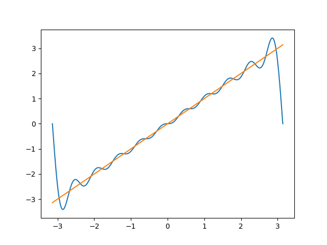

# Fourier Plotter

Built this script to check fourier series coefficients after calculating.
Script will not calculate but simply plot the actual function and the fourier approximation.

Can be used to check the values of coefficients by plotting it out.

The Fourier Series is approximated as  $f(x) = a_0 + \sum(a_n \cdot \cos(n \cdot x) + b_n \cdot \sin(n \cdot x))$


Changable Parameters

The following parameters can be modified to customize the Fourier Plotter:

- `actual_function` : The actual function to be approximated
- `a_0`: The coefficient for the constant term in the Fourier series.
- `a_n`: The coefficients for the cosine terms in the Fourier series.
- `b_n`: The coefficients for the sine terms in the Fourier series.
- `start`: Starting value of the interval
- `end` : Ending value of the interval
- `terms` : No of terms used for approximation


These parameters can be adjusted to experiment with different functions and visualize their Fourier approximations.


## Usage

To use the Fourier Plotter, follow these steps:

1. Install the required dependencies by running the following command:
   ```bash
   pip install -r requirements.txt
   ```

2. Modify the changable parameters in the script according to your requirements.

3. Run the script to plot the actual function and its Fourier approximation.

**Example**

- Actual function: f(x) = x
- Coefficients:
    - a_0 = 0
    - a_n = 0
    - b_n = -2 * math.cos(n*math.pi) / n

Plot of actual function and approximation



